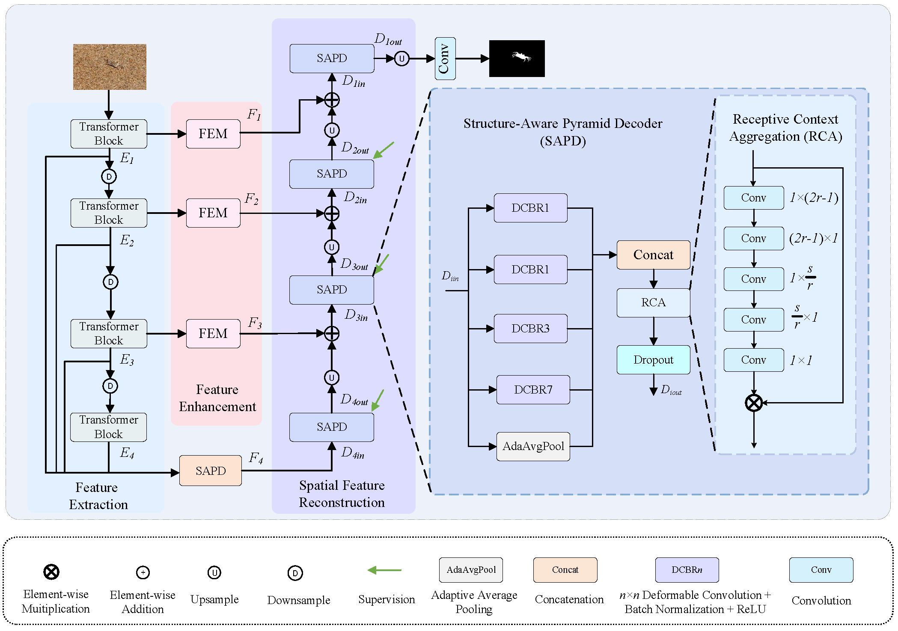

# AdaS-Net: Adaptive Structure-aware Network for Camouflaged Object Detection.

Hongchen Wang, [Shuzhen XU](https://dgzsdxzz.github.io/ShuzhenXu/), Cuicui Lv, Qiang Zheng, and Kaile Su, "AdaS-Net: Adaptive Structure-aware Network for Camouflaged Object Detection", Knowledge-Based Systems, 2025


[[paper]()] [[visual results]( https)]

<!-- #### 🔥🔥🔥 News -->


---

> **Abstract:** Camouflaged Object Detection (COD) aims to identify and segment objects that are visually blended into their surroundings, where object and background share highly similar color, texture, and structure. Such intrinsic resemblance suppresses discriminative cues and leads to weak contrast, blurred boundaries, and inconsistent scales, posing persistent challenges for conventional detection or segmentation pipelines. To address these issues, this paper presents an Adaptive Structure-aware Network (AdaS-Net) that unifies global semantic reasoning and local structural perception within a “see–enhance–reconstruct” paradigm. A Swin Transformer backbone first establishes hierarchical long-range representations to capture subtle semantic differences under high background similarity. On top of this representation, a Feature Enhancement Module (FEM) magnifies weak structural cues through orientation-aware depthwise convolutions and a dynamic kernel weighting mechanism, selectively emphasizing discriminative object regions while suppressing background interference. A Structure-Aware Pyramid Decoder (SAPD) then performs deformable multi-scale fusion and progressive top–down refinement, aligning high-level semantics with low-level boundary details for coherent object reconstruction. Extensive experiments on public COD benchmarks, including CAMO, COD10K, NC4K, and CHAMELEON, demonstrate that AdaS-Net consistently surpasses state-of-the-art convolutional and Transformer-based approaches in both detection accuracy and structural fidelity. By integrating adaptive structural enhancement with hierarchical semantic reconstruction, AdaS-Net establishes a new structure-aware paradigm for COD and offers a general perspective for structure-sensitive segmentation in complex visual environments.




## ⚙️ Dependencies

- Python 3.10
- PyTorch 2.4.0
- NVIDIA GPU + [CUDA](https://developer.nvidia.com/cuda-downloads)

```bash
# Clone the github repo and go to the default directory 'AdaS-Net'.
git clone https://github.com/tian-xiu/AdaS-Net.git
conda create -n AdaS-Net python=3.10
conda activate AdaS-Net
pip install -r requirements.txt
```


## 🔗 Contents

1. [Datasets](#datasets)
1. [Training](#training)
1. [Testing](#testing)

---


## <a name="datasets"></a>🖨️ Datasets

### Training and Testing Datasets

Used training and testing sets are organized as follows:

**Training Set:**
- COD10K 
- CAMO

**Testing Set:**
- CHAMELEON 
- NC4K 
- TE-CAMO 
- TE-COD10K

### Directory Structure

Download and organize the datasets into `data/` folder with the following structure:

Download training and testing datasets and place them into the corresponding folders of `data/`. The directory structure should be organized as follows:


Download training and testing datasets and put them into the corresponding folders of `data/`. See [data](data/README.md) for the detail of the directory structure.


## <a name="training"></a>🔧 Training

- Prepare the training datasets (COD10K and CAMO) and organize them in `data/train/` folder according to the directory structure mentioned in [Datasets](#datasets).

- Run `python train.py` to train the model on COD10K and CAMO datasets.

- The trained models will be saved in `checkpoints/` directory.


## <a name="testing"></a>🔨 Testing

### Test on Benchmark Datasets

- Place the testing datasets (CHAMELEON, NC4K, TE-CAMO, TE-COD10K) in `data/test/` folder with proper structure as mentioned in [Datasets](#datasets).

- Run `python test.py` to evaluate the model on all testing benchmarks.

- The test results (prediction masks and evaluation metrics) will be saved in `results/` directory.

